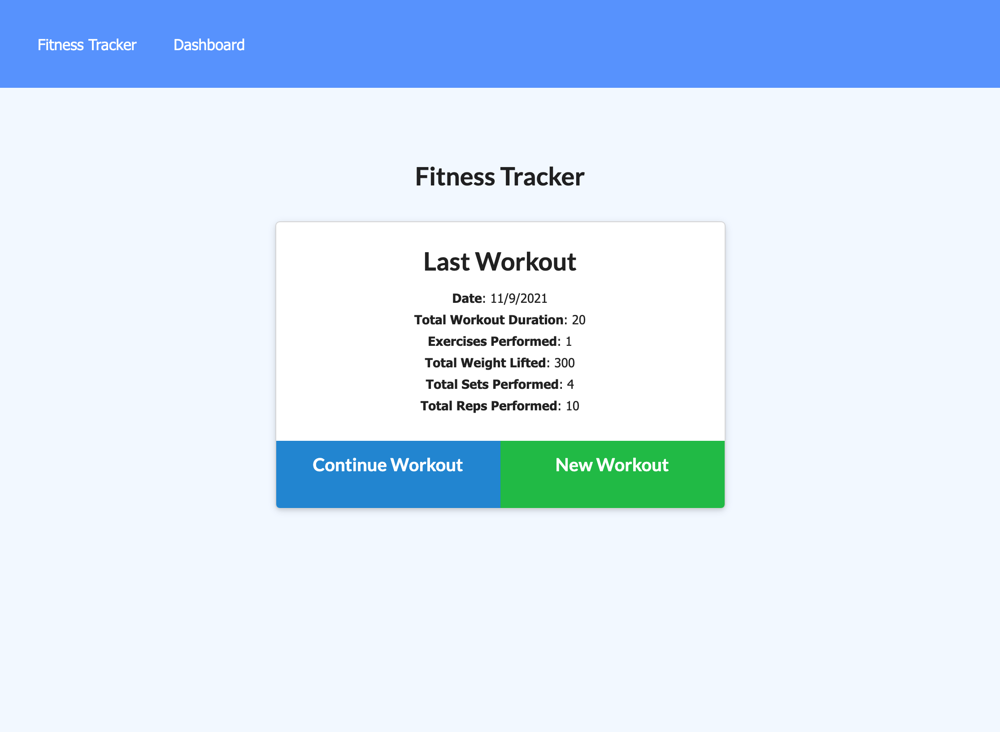
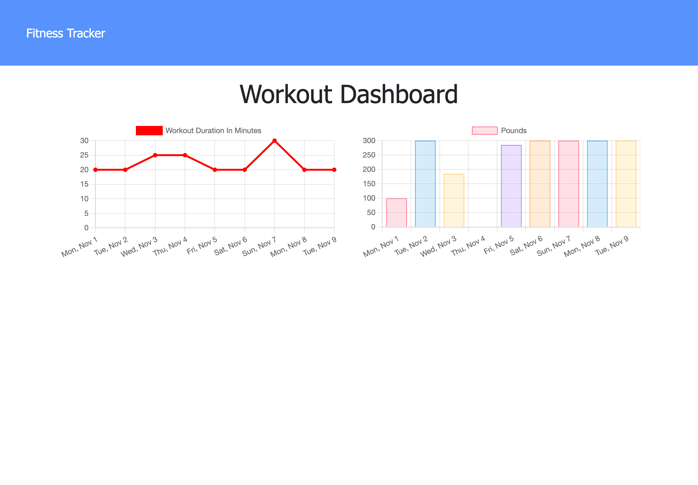

# Fitness Tracker

## Table of Contents
* <a href="#about">Link</a>
* <a href="#about">About</a>
* <a href="#preview">Preview</a>
* <a href="#user-story">User Story</a>
* <a href="#acceptance-criteria">Acceptance Criteria</a>
* <a href="#technologies">Technologies</a>

## Link
<b>Link to site:</b> https://codingnav-fitness-tracker.herokuapp.com/

## About 
Writing about tech can be just as important as making it. Developers spend plenty of time creating new applications and debugging existing codebases, but most developers also spend at least some of their time reading and writing about technical concepts, recent advancements, and new technologies. A simple Google search for any concept covered in this course returns thousands of think pieces and tutorials from developers of all skill levels!

<i><b>Tech Blog</b></i> is a CMS-style blog site similar to a Wordpress site, where developers can publish their blog posts and comment on other developers’ posts as well. The app follows the MVC paradigm in its architectural structure, using Handlebars.js as the templating language, Sequelize as the ORM, and the express-session npm package for authentication.


## Preview




## User Story
```
AS A user,
I WANT a website to log multiple exercises
SO THAT I am able to view create and track daily workouts. I want to be able to log multiple exercises in a workout on a given day. I should also be able to track the name, type, weight, sets, reps, and duration of exercise. If the exercise is a cardio exercise, I should be able to track my distance traveled.
```

## Acceptance Criteria
```
GIVEN a website to log multiple exercises
WHEN I load the page, I should be given the option to create a new workout or continue with my last workout.
WHEN I click continue workout, I should be able to add exercises to the most recent workout plan.
WHEN I click new workout, I should be able to add a new exercise to a new workout plan.
WHEN I click dashboard, I view a chart with the combined weight of multiple exercises from the past seven workouts.
WHEN I click dashboard, I view the total duration of each workout from the past seven workouts.
```


## Technologies
### Front End
&nbsp; &nbsp;
&nbsp; &nbsp; &nbsp; 
&nbsp; &nbsp; &nbsp; 

### Back End
  